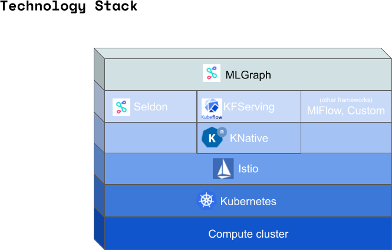

# MLGraph

MLGraph defines a graph of machine learning components. The goal is to provide a simple machine learning focused 
specification for defining:

  * Easy model Experimentation and AB tests
  * Advanced routing with Multi-Armed Bandits
  * Ensembling of models
  * Explanations, Outlier Detection, Skew and Bias detection
  * Builds upon KFServing and other ML Serving Components
  * Flexible graph nodes:
      * References or inline specs
  * Custom user provided components
  *Auto-validation of graph

An example graph:

## Definitions
 
  * [Control plane](docs/control-plane.md)
       * [Examples](docs/examples.md)
  * [Data plane](docs/data-plane.md)

## Implementations

There could be multiple implementations of the spec. The initial focus will be build upon KNative.

   * A [KNative implementation proposal](docs/knative-impl.md)
   * An [Apache Arrow proposal](docs/arrow-impl.md)

## Stack

## Discussion

The spec is a live document.

   * [Discussion Points](./docs/discussion.md)

