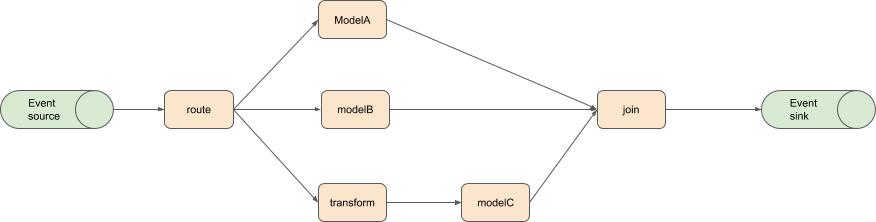

# MLGraph

MLGraph defines a graph of machine learning components. The goal is to provide a simple machine learning focused 
specification for defining:

  * A/B Tests and multi-model experimentation
  * Advanced optimization with Multi-Armed Bandits
  * Model Ensembles


An example graph:



An example specification for the above graph that requests an epsilon-greedy multi-armed bandit for the routing and a default ensembler for the join is shown below. Models are provided with KFServing specs and the transform step with a custom component.

```YAML
apiVersion: serving.mlspec.org/v1alpha2
kind: MLGraph
metadata:
  name: ensemble
spec:
  dag:
    - name: route
      route:
        mab:
          egreedy: 0.1    
    - name: modelA
      dependencies: [route]
      implementation:
        kfservice:
          spec:
            default:
              sklearn:
                modelUri: "gs://kfserving-samples/models/sklearn/iris/"          
    - name: modelB
      dependencies: [route]      
      implementation:
        kfservice:
          spec:
            default:
              xgboost:
                modelUri: "gs://kfserving-samples/models/xgboost/iris/"
    - name: transform
      dependencies: [route]
      implementation:
        custom:
          podSpec:
            containers:
                image: myorg/transformer:0.1

    - name: modelC
      dependencies: [transform]
      implementation:
        kfservice:
          spec:
            default:
              tensorflow:
                modelUri: "gs://kfserving-samples/models/tensorflow/iris/"
    - name: join
      dependencies: [modelA, modelB, modelC]
      merge:
        ensemble:
```

## Definitions
 
  * [Control plane](docs/control-plane.md)
  * [Data plane](docs/data-plane.md)

## Implementations

   * A [KNative implementation proposal](docs/knative-impl.md) 


