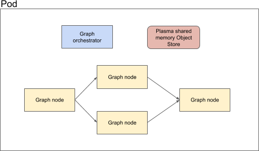

# Apache Arrow Implementation

The default [knative implementation](knative-impl.md) will be good for medium latency fault tolerant asynchronous use cases. However, users may wish to have a low latency implementation for their graph. To this end, if all components of the graph are containers then a single pod could be created with an orchestrator that uses Apache Arrow to manage the data plane flow of the request through the individual components.

A schematic of the design is show below:

## Key concepts

 * In memory arrow data structures are shared between containers to allow zero-copy data transfer and use for each message transfered between components.
 * A graph orchestrator manages the request/response flow
 * Knative implementation will require a mutation admission controller to pack all containers into a single pod.
 * Nvidia Dali could be used to further share data structures between cpu and gpu

