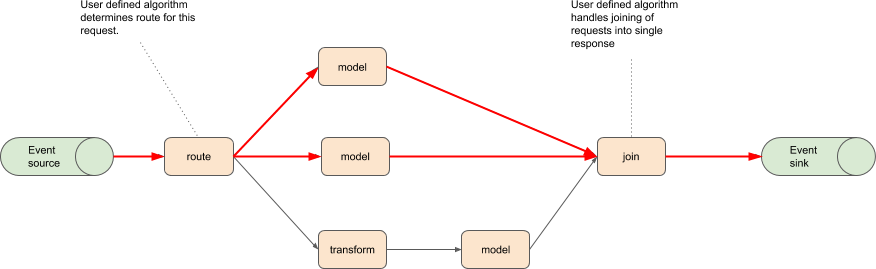
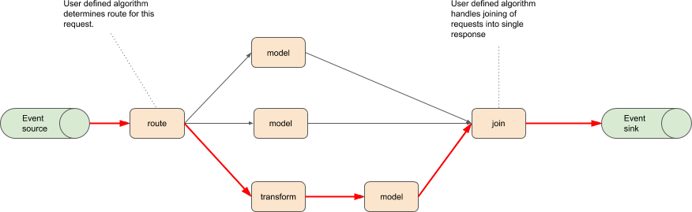

# Data Plane for ML Graph

ML Graph adds two specific operations: Route and Join. Users can provide custom implementations for these.

An example graph:

One request flow through this could:

Another request could take the following route:

# Route Contract

A user should provide a server that:

 * Requests will contain a header `mlgraph/routable-nodes` with the names of valid nodes that this request can be routed to.
 * Returns a response with possibly modified payload with Header `mlgraph/route` with value the list of child node names the request should be routed to.

# Join Contract

A user should provide a server that:

 * Receives requests and eventually returns an aggregated request.
 * Upon receving the request if the merge should not be carried out then an empty reply should be returned.
 * Each request will contain a header `mlgraph/pending-requests` which will provide an upper bound on the number of requests that may still arrive for this transaction. It is an upper bound as other requests in this transaction may not have passed through all routing elements in the graph so it is uncertain if all routes to this node will actually be taken.

# Request Management

The MLGraph data plane will need to add components to add required headers for routing and joining, in particular:

  * `mlgraph/routable-nodes` : added to allow custom routing to know which child nodes can be routed to
  * `mlgraph/pending-requests` : added to allow custom joiner to know it can carry out join on all payloads
     * After a routing operation routes NOT taken would decrease pending request paths to future join operations

## KNative impplementation

Options:

 * Add sidecars to routing and join nodes to pre/postprocess the request/responses.
 * Add separate KNative services to pre/postprocess request/responses

Either method will need to add headers to the request to allow future components to catculate the `mlgraph/pending-requests` value for each node.

