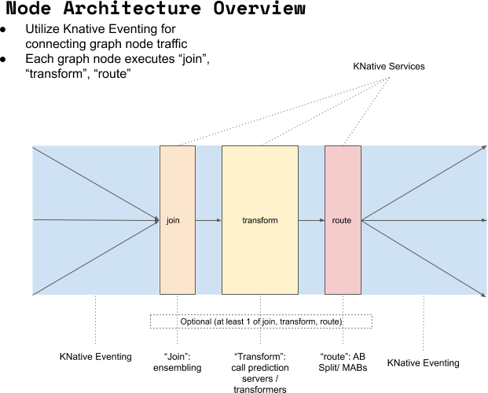
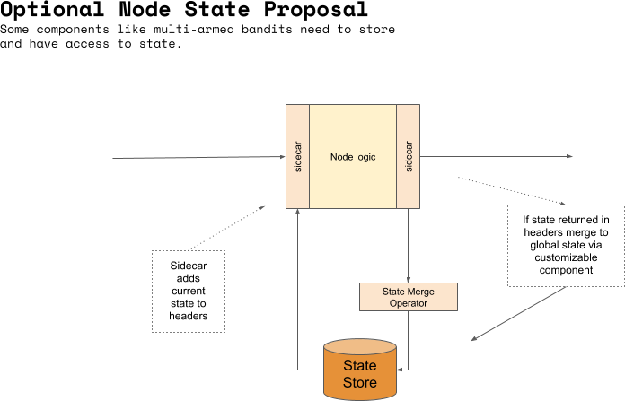

# Data Plane for ML Graph

 * [Request flow](#Request-Flow)
 * [Request Methods](#Request-Methods)
 * [Request Payloads](#Request-Payloads)
 * [Component Contracts](#Component-Contracts)
 * [Request Management](#Request-Management)
 * [State Management](#State-Management)

## Request Flow

ML Graph adds two specific operations: Route and Join. Users can provide custom implementations for these.

An example graph:


One prediction request flow through this could:


Another prediction request could take the following route:


For each node in the graph the request flow (and possible knative integration) is shown below:



Each node will define at least 1 of:

  * Join : ensemble requests
  * Predict/Transform : call prediction server or transformation service
  * Route : route to some subset of connected nodes


## Request Methods

 * **Predict** : Get a prediction from the graph
   * Example `http://endpoint/predict`
 * **Reward** : Send a reward for a previous prediction
    * Example `http://endpoint/reward`
 * **Explain** : Explain a particular request
    * Example `http://endpoint/explain`
 * **Outlier** : Check for Outlier 
    * Example `http://endpoint/outlier`
 * **Skew** : Check for Skew/Concept Drift
    * Example `http://endpoint/skew`
 * **Boas** : Check for bias
    * Example `http://endpoint/bias`

## Request Payloads

### Predict

  * Request : Tensorflow or Seldon request payloads until we unify on a single MLGraph payload.
  * Response: Tensorflow or Seldon response payloads until we unify on a single MLGraph payload.

### Reward

  * Request: A payload providing a reward for a previous prediction.
  * Response: Success notification

A new request payload will need to be created as there is no standard for this.

An example:

Send a reward of 1 for a previous prediction with prediction UID `1234`:

```json
{
 "puid": 1234
 "reward": 1
}
```

 * The reward needs to hit the graph nodes that the given request `1234` travelled.

### Explain

 * Request: Tensorflow or Seldon request payloads until we unify on a single MLGraph payload.
 * Response: Explanation method specific response payload: TBD

### Outlier

 * Request: Tensorflow or Seldon request payloads until we unify on a single MLGraph payload.
 * Response: Outlier response: TBD

### Skew

 * Request: empty request
 * Response: Current skew estinate: TBD

### Bias

 * Request: empty request
 * Response: Current bias estimate: TBD


## Component Contracts

### Route Contract

A user should provide a server that:

For **predict** calls:

 * Requests will contain a header `mlgraph/routable-nodes` with the names of valid nodes that this request can be routed to.
 * Returns a response with possibly modified payload with Header `mlgraph/route` with value the list of child node names the request should be routed to.

For **reward** calls:

 * Handles the reward for the given `puid` and returns an empty reply with success/failure

### Join Contract

A user should provide a server that:

For **predict** calls:

 * Receives requests and eventually returns an aggregated request.
 * Upon receiving the request if the merge should not be carried out then an empty reply should be returned.
 * Each request will contain a header `mlgraph/pending-requests` which will provide an upper bound on the number of requests that may still arrive for this transaction. It is an upper bound as other requests in this transaction may not have passed through all routing elements in the graph so it is uncertain if all routes to this node will actually be taken.

For **reward** calls:

 * Handles the reward for the given `puid` and returns an empty reply with success/failure

### Model Contract

Current protocols such as Seldon's have the same payload for request and responses so components can always we connected into a graph. For other protocols such as Tensorflow's the prediction request payload differs from the prediction response and therefore the ability of nodes in a graph being able to be connected would need verification.

### Explanation Contract

For **predict calls**

  * Receive a predict request and generate explanation response to reporting endpoint

For **explain calls**

  * Receive a predict payload and generate a synchronous response

### Outlier Contract

For **Predict calls**

 * Receive a predict request and generate outlier response to reporting endpoint

For **Outlier calls**

 * Receive a predict payload and generate an outlier synchronous response

### Skew Contract

TBD


## Request Management

The MLGraph data plane will need to add components to add required headers for routing and joining, in particular:

  * `mlgraph/routable-nodes` : added to allow custom routing to know which child nodes can be routed to
  * `mlgraph/pending-requests` : added to allow custom joiner to know it can carry out join on all payloads
     * After a routing operation routes NOT taken would decrease pending request paths to future join operations

### KNative implementation

Options:

 * Add sidecars to routing and join nodes to pre/postprocess the request/responses.
 * Add separate KNative services to pre/postprocess request/responses

Either method will need to add headers to the request to allow future components to calculate the `mlgraph/pending-requests` value for each node.


## State Management

State management is needed for several reasons:

 * Stateful routers/models e.g., Running online models such as multi-armed bandit solvers that need to keep current state to decide which route a new request will travel
 * Reward API calls that need to be sent to nodes a previous request travelled through
 * Scaling up and down of above stateful models means new replicas need:
    * warm start to ensure state does not need to be recreated
    * state sharing in multi replicas scenarios to ensure (if needed) that all models are in sync

The calls that might be needed by components are:

 * Get (previous) request payload with this prediction ID at this node.
 * Get state for my node
 * Push my state to reconcile with global state for my node (and return new reconciled global state)



