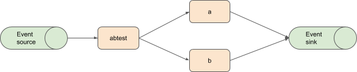
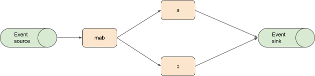
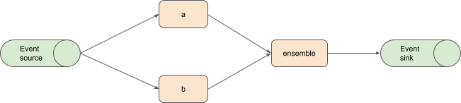
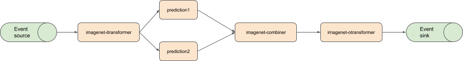
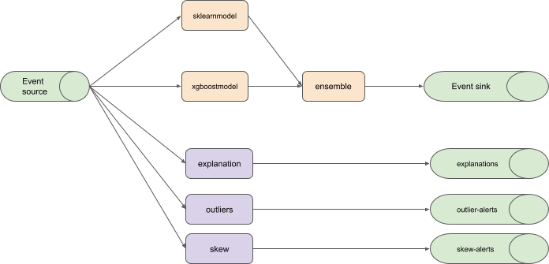

# Examples MLGraphs

## AB Test to KFServices

An AB Test refering to existing KFServices in the same namespace.



```YAML
apiVersion: serving.mlspec.org/v1alpha2
kind: MLGraph
metadata:
  name: abtest
  namespace: test
spec:
  dag:
    - name: abtest
      route:
        split:
    - name: a
      dependencies: [abtest]
      implementation:
        ref:
          kfservice: sklearnModel
    - name: b
      dependencies: [abtest]
      implementation:
        ref:
          kfservice: xgboostModel
```

[ref](./samples/ab_test_kfservice_refs.yaml)


## Multi-Armed Bandit to Inline KFservices



```YAML
apiVersion: serving.mlspec.org/v1alpha2
kind: MLGraph
metadata:
  name: mab_kf
  namespace: test
spec:
  dag:
    - name: mab
      route:
        mab:
          egreedy: 0.1
    - name: a
      dependencies: [mab]
      implementation:
        inline:
          kfspec:
            default:
              sklearn:
                modelUri: "gs://kfserving-samples/models/sklearn/iris/"
    - name: b
      dependencies: [mab]
      implementation:
        inline:
          kfspec:
            default:
              xgboost:
                modelUri: "gs://kfserving-samples/models/xgboost/iris/"
    - name: c
      dependencies: [mab]
      implementation:
        inline:
          kfspec:
            default:
              tensorflow:
                modelUri: "gs://kfserving-samples/models/tensorflow/iris/"

```

[ref](./samples/mab_inline_kfservices.yaml)

## Ensemble from Custom References

An ensemble using running kubernetes resources.



```YAML
apiVersion: serving.mlspec.org/v1alpha2
kind: MLGraph
metadata:
  name: ensemble
  namespace: test
spec:
  dag:
    - name: a
      implementation:
        ref:
          custom:
            apiVersion: serving.kubeflow.org/v1alpha1
            kind: KFService
            name: xgboostServer
    - name: b
      implementation:
        ref:
          custom:
            apiVersion: serving.ml.org/v1alpha1
            kind: MLServer
            name: sklearnServer
    - name: c
      implementation:
        ref:
          custom:
            apiVersion: serving.company.com/v1alpha1
            kind: MLCustomServer
            name: customServer
    - name: ensemble
      dependencies: [a, b, c]
      merge:
        ensemble:

```

[ref](./samples/ensemble_custom_refs.yaml)

## Complex Example


Each component is implemented via a different method:

  * A reference to an existing kfservice (modelA)
  * An inline kfservice spec  (modelB)
  * An inline podspec (transform)
  * A URI to an external service (modelC)

```YAML
apiVersion: serving.mlspec.org/v1alpha2
kind: MLGraph
metadata:
  name: ensemble
  namespace: test
spec:
  dag:
    - name: route
      route:
        mab:
          egreedy: 0.1    
    - name: modelA
      dependencies: [route]
      implementation:
        ref:
          kfservice: sklearnModel
    - name: modelB
      dependencies: [route]      
      implementation:
        inline:
          kfspec:
            default:
              xgboost:
                modelUri: "gs://kfserving-samples/models/xgboost/iris/"
    - name: transform
      dependencies: [route]
      implementation:
        inline:
          podspec:
            containers:
                image: myorg/transformer:0.1
    - name: modelC
      dependencies: [transform]
      implementation:
        ref:
          uri: http://external.org/model
    - name: join
      dependencies: [modelA, modelB, modelC]
      merge:
        ensemble:

```

[ref](./samples/route_and_ensemble.yaml)


## Inline example



```YAML
apiVersion: serving.mlspec.org/v1alpha2
kind: MLGraph
metadata:
  name: inline-example
  namespace: test
spec:
  inline:
    - podspec:
        containers:
          - name: imagenet-itransformer
            image: seldonio/openvino-demo-transformer:0.1
          - name: imagenet-otransformer
            image: seldonio/openvino-demo-transformer:0.1
          - name: prediction1
            image: seldonio/openvino-demo-prediction:0.2
          - name: prediction2
            image: seldonio/openvino-demo-prediction:0.2
          - name: imagenet-combiner
            image: seldonio/openvino-demo-combiner:0.1
      replicas: 1              
  dag:
    - name: imagenet-itransformer
    - name: prediction1
      dependencies: [imagenet-itransformer]
    - name: prediction2
      dependencies: [imagenet-itransformer]
    - name: imagenet-combiner
      dependencies: [prediction1, prediction2]
      merge:
          ensemble:
            implementation:
              name: imagenet-combiner
    - name: imagenet-otransformer
      dependencies: [imagenet-combiner]        

```

[ref](./samples/inline.yaml)


## Ensemble With Analysis




```YAML
apiVersion: serving.mlspec.org/v1alpha2
kind: MLGraph
metadata:
  name: ensemble
  namespace: test
spec:
  dag:
    - name: a
      implementation:
        ref:
          kfservice: sklearnModel
    - name: b
      implementation:
        ref:
          kfservice: xgboostModel
    - name: ensemble
      dependencies: [a, b]
      merge:
        ensemble:
  analysis:
    explanation:
      method: anchors-tabular
      activation: 0
      reporting:
        ref:
          apiVersion: eventing.knative.dev/v1alpha1
          kind: Channel
          name: explanations
    outliers:
      activation: 100
      reporting:
        ref:
          apiVersion: eventing.knative.dev/v1alpha1
          kind: Channel
          name: outlier-alerts
    skew:
      activation: 10
      reporting:
        ref:
          apiVersion: eventing.knative.dev/v1alpha1
          kind: Channel
          name: skew-alerts
      

```