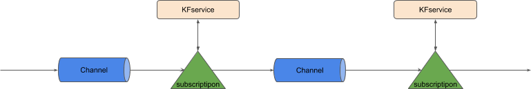
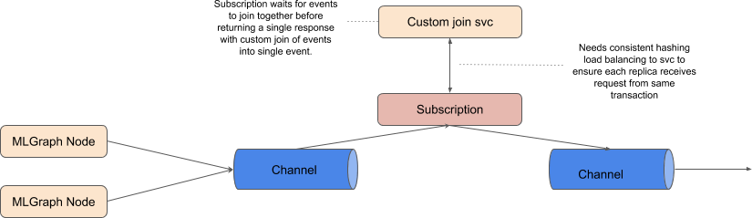

# KNative Implementation for MLGraph Proposal

The is a work-in-progress proposal of how a KNative implementation could be created for MLGraph.

There are thre core operations that need to be applied:

  * pipeline: join nodes together in a sequence in the graph
  * Route: Route request to 1 or more subsequent nodes in the graph
  * Join: Join a set of responses from dependent nodes in the graph

Messages will be passed through the graph and be sequenced, split and joined as defined by the specification.

## Pipeline

A KNative implementation for sequencing together a set of nodes (e.g. kfservices) is shown below:

We could also use the existing knative [CRD for sequnces](https://github.com/knative/eventing/blob/master/pkg/apis/messaging/v1alpha1/sequence_types.go).

## Route

We need to be able to allow algorithmic control over requests passing through the graph. The route operation will allow each request to be specified which of 0 or more child nodes the request proceeds to.

A KNative implementation is shown below:

A Channel with a Subscription that applies meta data to the CloudEvent for each request that allows a subsequent Broker with Filters for each path to be used to direct requests. Headers would need to be added to the CloudEvent that will be matched by the Filters for each possible path to forward the request.

Notes:

 * An MLGraph component should provide to the router server the possible active paths that can be chosen
 
## Join
 
We need a component that will allow events that have passed through the previous graph nodes to be joined together. When a request is managed by the graph it will be given a unique ID. The role of the join component will be to join together events that have the same ID into a single event. A rough design is shown below:

Notes:

 * An MLGraph component should provide to the join server whether the current event is the last for this request. This will allow the joiner server to produce a final joined result.

 
 
 