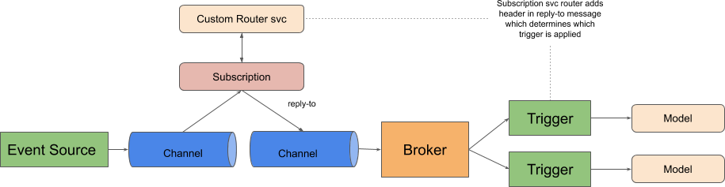

# KNative Implementation for MLGraph Proposal

The is a work-in-progress proposal of how a KNative implementation could be created for MLGraph.

There are two core operations that need to be applied:

  * Route: Route request to 1 or more subsequent nodes in the graph
  * Merge: Merge a set of responses from dependent nodes in the graph
  
## Route

We need to be able to allow algorithmic control over requests passing through the graph. The route operation will allow each request to be specified which 1 or more child nodes the request proceeds to. 

 This could be accomplished via a Channel with custom Subscription that applies meta data to the CloudEvent 
 for each request that allows a subsequent Broker with Filters for each path to be used.
 

 
 
## Merge
 
 
 
 
 
 