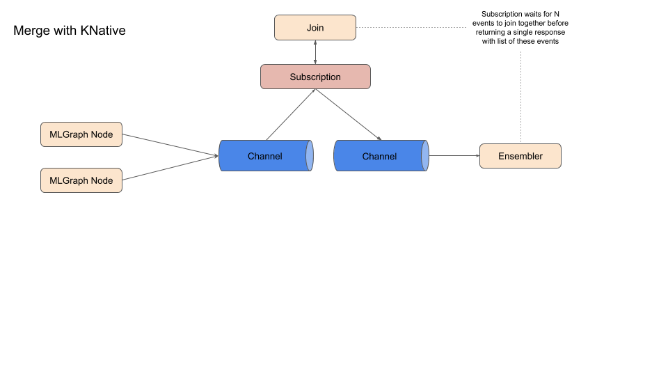

# KNative Implementation for MLGraph Proposal

The is a work-in-progress proposal of how a KNative implementation could be created for MLGraph.

There are two core operations that need to be applied:

  * Route: Route request to 1 or more subsequent nodes in the graph
  * Merge: Merge a set of responses from dependent nodes in the graph

Messages will be passed through the graph and be split and merged as defined by the specification.

## Route

We need to be able to allow algorithmic control over requests passing through the graph. The route operation will allow each request to be specified which of 0 or more child nodes the request proceeds to.

A KNative implementation is shown below:

A Channel with a Subscription that applies meta data to the CloudEvent for each request that allows a subsequent Broker with Filters for each path to be used to direct requests. Headers would need to be added to the CloudEvent that will be matched by the Filters for each possible path to forward the request.

Notes:

 * A component should provide to the router server then possible active paths that can be chosen
 * As described the rouring server can be stateless

 
## Merge
 
We need a component that will allow events that have passed through the previous graph nodes to be joined together for one external request. When a request is managed by the graph it will be given a unique ID. The role of the merge component will be to join together events that have the same ID into a single event. A rough design is shown below:

Notes:

  * The challenge is for any such component to know when all events for a single request have reached it so that it can do its merge processing and emit a final event. This means the merge server needs to be stateful as multiple requests may need to arrive to the server before it can emit a merged result. Can KNative provide "sticky" routing to Subcription servers to handle this?
  

## Questions

 * Does KNative have the resilience to handle retries for lost messages?
 
 
 
 